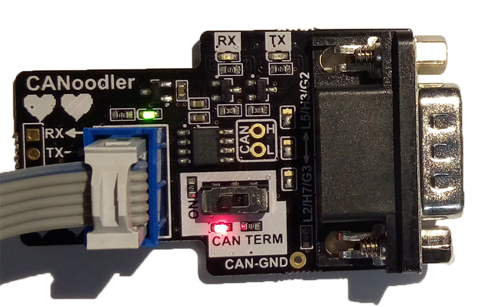

# CANoodler #
CAN to 3.3V logic level interface. Dumb. Cheap. Simple. Pick 3.

## About CANoodler ##

CANoodler is a simple CAN (not CAN-FD) interface, which provides logic-level 3.3V output. It's designed to be used with microcontrollers that have CAN blocks inside them, and in particular uses a pinout on some ChipWhisperer CW308 (UFO) Target boards.

It's kinda nice (I think anyway) since it has these features:

* LEDs for TX/RX (uses MOSFET to drive LEDs so doesn't slow your I/O pins down).
* Reverse-polarity protection on 3.3V input.
* Switch for CAN termination on/off with LED feedback.

As CANoodler is not isolated, be aware you should be careful using this in a high-noise environment. The CAN-GND and I/O GND are connected directly together on this board.

## Getting CANoodler ##

CANoodler will be sold by NewAE Technology Inc. (estimated available October 2017), but it's open-source hardware so you can just build one. See below for build instructions if you can't wait.

## Using CANoodler ##

CANoodler is simple to use. Simply:

* Connect the RX pin to your microcontroller CAN-RX pin (this is an OUTPUT from the CANoodler).
* Connect the TX pin to your microcontroller CAN-TX pin (this is an INPUT to the CANoodler).
* Provide 3.3V power to the board.
* Select if you'd like the termination resistor ON or OFF with the switch.

The solder jumpers specify which pinout you'd like on the male DB9 connector.

The default pinout is selected by shorting the LOWER and MIDDLE solder jumpers. It is used by many boards and the Peak CAN USB interface:

* CAN-Low = Pin 2
* CAN-High = Pin 7
* CAN-GND = Pin 3

The "option" pinout is set by moving each of the three solder jumpers to short the UPPER and MIDDLE pads. This pinout is used by cheap ODB-II to DB9 connectors:

* CAN-Low = Pin 5
* CAN-High = Pin 3
* CAN-GND = Pin 2

## Building CANoodler ##

To build CANoodler, you'll need the following:

* CANoodler PCB.
* Parts for CANoodler.
* Ability to solder and/or coerce someone who can solder into doing your work

### CANoodler PCB ###

You can order the PCB from [OSH Park](https://oshpark.com/projects/aEDxzHX4) or upload the gerber zip-file somewhere you like.

The CANoodler PCB doesn't have part designators on the PCB. Not because I have you and want to make it hard-mode to build your own, but because I prefer having a cleaner final PCB and planned on mostly assembling these with a pick-n-place machine.

There is an assembly drawing you will need to refer to when building the unit.

### CANoodler Parts ###

The parts list is pretty standard. The only gotcha is the 0603 size resistor for the 120-ohm CAN termination should be a 1/4W device. I recommend using P/N ERJ-PA3F1200V (this is what is used in the production built units), since it is "pulse rated" so should deal with overload a little better. 

If you use a 1/10W (standard 0603) it will be mostly fine, as the CAN bus will idle around 2.5V, which means a constant 1/20W dissipation in your resistor. But if anything goes wrong (short to +5V even) you might burn up the resistor.

## License ##

The schematic lists the license as LGPL, which is good enough I hope. 

## CANoodler Name ##

If you've gotten this far and didn't figure it out, the name is a joke on the word "[canoodle](https://www.merriam-webster.com/dictionary/canoodle)". Hence all the hearts on the PCB. I tried anyway.